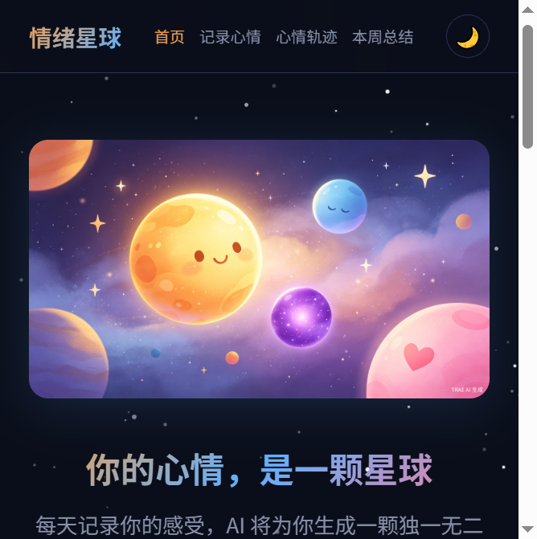

# 情绪星球

> 青少年心情可视化日记 —— 每天记录你的感受，AI 为你生成一颗独一无二的情绪星球



## 项目简介

「情绪星球」是一款面向青少年的心情可视化日记工具。用户每天选择一种情绪、写下感受，系统会自动生成一颗对应颜色的星球，并通过本地 AI 关键词匹配给出温暖的情绪回应。随着记录积累，星球会逐渐成长进化，帮助青少年以直观、有趣的方式觉察和理解自己的情绪变化。

**纯前端实现，零后端依赖，数据完全存储在本地浏览器中。**

## 功能特性

### 情绪记录
- **7 种情绪**：😊 开心、☀️ 平静、😢 难过、😡 烦躁、❤️ 感动、😨 焦虑、💫 惊喜
- **文字输入**：自由书写当天感受，支持 500 字上限和实时字数统计
- **AI 回复**：基于关键词匹配 + 情绪标签的智能融合，提供场景化情绪回应和鼓励

### 星球成长
- **7 级成长体系**：星尘 → 萌芽 → 幼星 → 行星 → 巨星 → 恒星 → 星系
- 星球大小、光晕、轨道粒子随等级变化
- 多情绪记录时星球呈现双色渐变混合效果
- 脉冲光晕呼吸动画 + 流星随机划过

### 数据可视化
- **心情轨迹**：按日期分组的时间线视图，支持删除和导出
- **本周总结**：统计卡片（总记录、最常见情绪、连续天数等）+ 情绪分布柱状图 + **情绪趋势折线图**
- **洞察分析**：积极/消极比例、连续打卡鼓励、成长提示

### 数据管理
- **导出**：支持 JSON（完整备份）和 TXT（可读格式）两种导出
- **导入**：支持从 JSON 备份文件恢复数据，自动去重合并
- **本地存储**：所有数据保存在 `localStorage`，隐私安全

### 视觉体验
- 深色太空主题 + 日间/夜间模式切换（偏好自动保存）
- 首次访问星球诞生引导动画（可重新观看）
- 星空背景 + 轨道粒子 + 流星效果

## 技术栈

- **HTML5** + **CSS3** + **原生 JavaScript**
- 零框架依赖，单文件部署
- CSS 自定义属性（变量）实现主题系统
- SVG 内联绘制趋势折线图
- `localStorage` 持久化数据存储
- `Blob` + `FileReader` 实现导入导出

## 快速开始

### 在线使用

直接用浏览器打开 `emotion-planet.html` 即可使用。

### 本地开发

```bash
# 克隆仓库
git clone https://github.com/daka-agent/EmotionalPlanet.git

# 进入项目目录
cd EmotionalPlanet

# 启动本地服务器（可选，直接打开 HTML 也可）
python -m http.server 8080

# 浏览器访问
# http://localhost:8080/emotion-planet.html
```

## 项目结构

```
emotion-planet/
├── emotion-planet.html    # 主应用（单文件，包含所有 HTML/CSS/JS）
├── assets/
│   ├── hero_1280x720.jpg  # 首页 Hero 图片
│   └── screenshot.png     # 项目截图
└── README.md
```

## 情绪类型

| 情绪 | 颜色 | 星球描述 |
|------|------|----------|
| 😊 开心 | 金黄 `#ffd060` | 阳光温暖，星球闪耀着金色光芒 |
| ☀️ 平静 | 天蓝 `#60c0e0` | 如湖水般宁静，星球泛着柔和蓝光 |
| 😢 难过 | 靛蓝 `#8080c0` | 星球蒙上一层薄雾，但星光依然在 |
| 😡 烦躁 | 赤红 `#e06050` | 星球表面涌动着红色岩浆，需要冷却 |
| ❤️ 感动 | 粉红 `#f080a0` | 星球绽放粉色光芒，温暖而柔软 |
| 😨 焦虑 | 紫色 `#a070d0` | 星球被紫色迷雾环绕，深呼吸会好些 |
| 💫 惊喜 | 翠绿 `#50d0a0` | 星球突然亮起翠绿光芒，充满活力 |

## 星球成长等级

| 等级 | 所需记录 | 解锁效果 |
|------|----------|----------|
| Lv.1 星尘 | 0 条 | 基础星球 |
| Lv.2 萌芽 | 3 条 | 星球凝聚，微弱光芒 |
| Lv.3 幼星 | 7 条 | 星球成形，第一道光环 + 轨道粒子 |
| Lv.4 行星 | 14 条 | 真正的行星 |
| Lv.5 巨星 | 25 条 | 光芒耀眼 |
| Lv.6 恒星 | 40 条 | 情绪宇宙中的恒星 |
| Lv.7 星系 | 60 条 | 照亮整个星系 |

## 设计理念

「情绪星球」的核心理念是**让抽象情绪变得可见**。通过将每天的心情映射为一颗颗色彩各异的星球，青少年可以：

1. **觉察情绪**：每天花一分钟记录，培养情绪感知习惯
2. **看见变化**：通过趋势图和时间线回顾情绪波动规律
3. **获得支持**：AI 回复提供温暖的情绪疏导和正向鼓励
4. **建立韧性**：星球成长机制激励持续记录，形成积极反馈循环

## 浏览器兼容

- Chrome 80+
- Firefox 75+
- Safari 13+
- Edge 80+

## 许可证

MIT License

## 致谢

专为青少年心理健康设计，希望每一位用户都能在自己的情绪宇宙中找到属于自己的星光。
